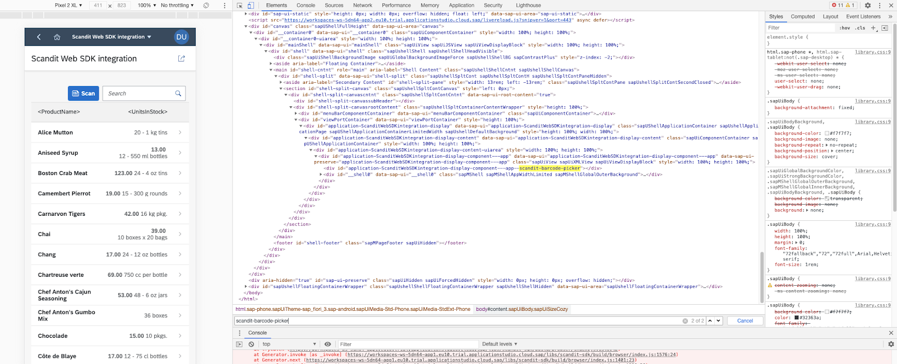

# How to integrate the Scandit SDK for the Web in SAPUI5 freestyle applications

## Introduction

The aim of this tutorial is to provide an example of how to integrate the Scandit SDK for the Web in SAPUI5 freestyle applications. To simplify the setup an SAP Fiori application based on a *SAPUI5 freestyle* template ([formerly known as SAP Fiori Freestyle](https://blogs.sap.com/2021/02/08/simplifying-application-generation-for-sapui5-freestyle-and-sap-fiori-elements-apps/)) will be used.

Keep in mind that there are multiple other valid ways to integrate the Scandit SDK for the Web in SAPUI5 applications - this is only one example.

## Prerequisites

* [SAP Business Technology Platform trial account](https://www.sap.com/cmp/td/sap-cloud-platform-trial.html) (formerly known as SAP Cloud Platform)
* SAP Business Application Studio Setup
  + [Set Up SAP Business Application Studio for Development](https://developers.sap.com/tutorials/appstudio-onboarding.html)
  + What kind of application do you want to create? Select SAP Fiori
  + Start the created dev space and open it.

## Tutorial

### Part 1: Setup SAP Environment

The following content is inspired by this video:
[SAP Tech Bytes: Tutorial - Creating a Multi-module SAP Fiori Project](https://www.youtube.com/watch?v=yvUUBbw85-M) 

Open a workspace in SAP Business Application StudioSet the organization by clicking on the “The organization and space in CF has not been set” message at the bottom-left corner. Then use the default selection for the Cloud Foundry endpoint and provide your SAP credentials in the following pop-ups.
   


   
Choose “Start from template" 


Select "Basic Multitarget Application” and click “Start”. 


Provide a name (we use "mtaproject”) and click “Finish". 


_A minimal project containing a .gitignore and mta.yaml file should appear._

Right-click the mta.yaml file and select “Create MTA Module from Template”


Select Approuter Configuration and click "Start”.


Select "Managed Approuter”, use “mtaproject” as an unique name and make sure “Yes” is selected in the UI question. Then click “Next”.


You should see more content in the mta.yaml now and a notification that the files were generated. 


Go back to the "Welcome” tab (in case you closed it you can open it via “Help”->”Welcome”). Select “Start from template”.


Scroll down the list, select "SAP Fiori application” and click “Start”.


Select the following configuration and click "Next":
*  *Application Type:* _SAPUI5 freestyle_
* *Which floorplan do you want to use?* _SAP Fiori Worklist Application_


Select "Connect to an ODATA Service” and use the URL:
“https://services.odata.org/V2/Northwind/Northwind.svc/"


Select the following entities and click "Next":
* *Object collection:*	_Products_
* *Object collection key:*  _ProductIDObject_ 
* *ID:*	_ProductNameObject_ 
* *Number:*	_UnitsInStockObject_ 
* *unit of measure:*	_QuantityPerUnit_


Select/fill out the following fields and click "Next":\
Please mind that the project folder path is the one of the project created before and not the general project folder.

* *Module name:*  _testproject_
* *Application title:* _Scandit Web SDK integration_
* *Application namespace:* _ns_
* *Description:* _A Fiori application._
* *Project folder path:* `/home/user/projects**/mtaproject****`
* *Add deployment configuration to MTA project (...):* _Yes_
* *Add FLP configuration:* _Yes_
* *Configure advanced options:* _No_


Select/fill out the following fields and click "Next":

* *Please choose the target:* _Cloud Foundry_
* *Destination name:* _Northwind - https://services.odata.org/_


Select/fill out the following fields and click "Next":
* *Semantic Object:* 	  _Product_
* *Action:* 					_View_
* *Title:* 						_Public App_


After project generation finished you can test the just created app.\
Right-click the “testproject” folder on the left panel and select “Preview Application”.

      


      

Click “start (fiori run …)” in the upcoming dialog. The app should then start in a new tab (mind your pop-up filter).

      


      

The started app should look like this:

      


      


### Part 2: Integrate Scandit SDK

You are now ready to integrate the Scandit SDK for the Web.

Open a terminal window via “Terminal”->”New Terminal” in the menu bar at the top. Navigate to the root directory of the “testproject” and install the Scandit WebSDK NPM package and store it to the package.json file via the following commands:

 `$ cd testproject/user: testproject`

 `$ npm i -s scandit-sdk`


The WebSDK is now installed and added to the package.json file as a dependency. The next step is to create a trigger button to open the scanner as a search input method. Therefore you need to modify the View of the Worklist. Open the file “mtaproject/testproject/webapp/view/Worklist.view.xml” in the editor. Add this code snippet after the ToolbarSpacer element of the OverflowToolbar inside the “Worklist.view.xml” file:

```
​            <!-- Trigger Button for Scandit WebSDK BarcodePicker -->
​            <Button
​              id="triggerScanInputButton"
​              icon="sap-icon://bar-code"
​              press=".onScanInputButton"
​              text="Scan"
​              type="Emphasized"/>
```


If you preview the application a Scan-button like the following should appear:


The next step is needed to use the locally installed library in a deployed application (like the one deployed when using the “Preview Application” functionality). As only the “webapp” folder will be deployed, we need to copy the required NPM packages as libraries into the webapp folder. Therefore we create a libs folder inside the webapp directory and then copy the content of `node_modules` into it with the following Terminal commands:

 `$ mkdir testproject/webapp/libs`

 `$ cp -R testproject/node_modules/* testproject/webapp/libs/`


***Note**: For sure there is a more elegant way to achieve this. Unfortunately, we have not found it yet. If you have any feedback we would be happy to get in touch with you.*

Now we are going to use the WebSDK inside the controller of the Worklist View. Open the `testproject/webapp/controller/Worklist.controller.js` file in the editor.

Add the scandit-sdk as dependency to the controller via the following line:

```
sap.ui.define([
  "./BaseController",
  "sap/ui/model/json/JSONModel",
  "../model/formatter",
  "sap/ui/model/Filter",
  "sap/ui/model/FilterOperator",
  "../libs/scandit-sdk/build/browser/index", // include the WebSDK as dependency
], function (BaseController, JSONModel, formatter, Filter, FilterOperator) {

Then mark the function onInit as async and add the following lines to the beginning of the function:

​    /**
​    \* Called when the worklist controller is instantiated.
​    \* @public
​    */
​    onInit : async function () {
​      var oViewModel,
​        iOriginalBusyDelay,
​        oTable = this.byId("table");
​      var licenseKey = "-- ENTER YOUR SCANDIT LICENSE KEY HERE --";
​      await ScanditSDK.configure(licenseKey,
​      {
​        engineLocation: "./libs/scandit-sdk/build/", // path to scan engine
​      });
```


Mind that you have to replace `-- ENTER YOUR SCANDIT LICENSE KEY HERE --` with a license key which matches the URL of the deployed application. In the case of the “Preview Application” used for debugging in SAP Business Application Studio you need to use “*.cloud.sap” as a Domain Name when creating the license key at https://ssl.scandit.com/licenses. Now you can create the BarcodePicker element below by using the following lines:

```
​      // create the BarcodePicker element for code128 barcodes
​      this.barcodePicker = await ScanditSDK.BarcodePicker.create(
​        document.getElementById("TODO INSERT ELEMENT ID"), { // version for debugging in SAP Business Application Studio (index.html does not exist)
​        scanSettings: new ScanditSDK.ScanSettings({
​          enabledSymbologies: ["code128"]
​        }),
​        playSoundOnScan: true,
​        vibrateOnScan: true,
​        scanningPaused: true,
​        visible: false, // hide the BarcodePicker initially (hidden initialization saves startup time when its used later on)
​      });
```


As you may have seen there is still an open TODO in the getElementById call. At this place you need to insert the element ID of the HTML element which should host the BarcodePicker. Therefore you need to add a placeholder element to the app. For this open the file `testproject/webapp/view/App.view.xml` . Then include the XML namespace for HTML and add a div element with the id `scandit-barcode-picker` :

```
<mvc:View
  controllerName="ns.testproject.controller.App"
  displayBlock="true"
  xmlns="sap.m"
  xmlns:mvc="sap.ui.core.mvc"
  xmlns:html="http://www.w3.org/1999/xhtml">

  <html:div id="scandit-barcode-picker"></html:div>  

  <Shell>
  <App
    id="app"
    busy="{appView>/busy}"
    busyIndicatorDelay="{appView>/delay}"/>
  </Shell>

</mvc:View>
```


The SAPUI5 toolchain will prefix this ID with the application name which is why you need to get the prefixed version directly via the browser. Preview the application and then use your browser debugging tools to get the final element id which is `application-ScanditWebSDKintegration-display-component---app--scandit-barcode-picker` in this case:



Now insert the copied element id into the getElementById call of the BarcodePicker creation:

```
​      // create the BarcodePicker element for code128 barcodes
​      this.barcodePicker = await ScanditSDK.BarcodePicker.create(
​        document.getElementById("application-ScanditWebSDKintegration-display-component---app--scandit-barcode-picker"), { // version for debugging in SAP Business Application Studio (index.html does not exist)
​        scanSettings: new ScanditSDK.ScanSettings({
​          enabledSymbologies: ["code128"]
​        }),
​        playSoundOnScan: true,
​        vibrateOnScan: true,
​        scanningPaused: true,
​        visible: false, // hide the BarcodePicker initially (hidden initialization saves startup time when its used later on)
​      });
```


Now add the callback function for scan results of the created BarcodePicker below the BarcodePicker creation:

```
​      // set the callback function for scan results of the BarcodePicker
​      this.barcodePicker.on("scan", (scanResult) => {
​        var toSearch = scanResult.barcodes[0].data;
​        // sap.m.MessageBox.show(toSearch);

​        // insert scanned value into searchField
​        var searchField = this.byId("searchField");
​        searchField.setValue(toSearch);
​        var searchParam = {};
​        searchParam.query = toSearch;
​        searchField.fireSearch(searchParam);

​        // pause scanning
​        this.barcodePicker.pauseScanning();
​        this.barcodePicker.setVisible(false);
​      });
```


The only thing which is missing now is a callback function for the ScanInputButton you created in the beginning. This callback should set the scanner visible and enable scanning. Insert the following code below the onSearch callback function:

```
​    /**
​    \* Event handler for Scandit's ScanInputButton for the Search Input via
​    \* camera-based barcode scanning.
​    */
​    onScanInputButton : function () {
​      this.barcodePicker.setVisible(true);
​      this.barcodePicker.resumeScanning();
​    },
```


You are now ready to use the camera to scan barcodes and trigger a search. Preview the application, it should look like this:


As soon as you click the scan button the camera preview will open (as this page contains only EAN/UPC barcodes but the BarcodePicker is configured to scan Code128 barcodes only, no barcode will be captured):


As soon a Code128 barcode appears on the screen it will be captured. As defined in the callback function on scan, the search is triggered with the captured barcode content as search term. You can see the filtered results below.


## Feedback

Do you have any questions or feedback to share? Please send us a message to [support@scandit.com](mailto:support@scandit.com). We'd love to hear from you!
